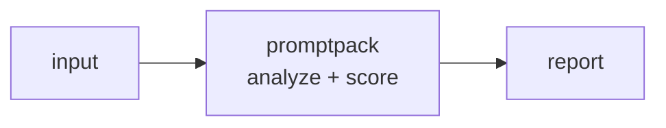

<a name="top"></a>
<div align="center">


# PROMPTPACK

### Versioned prompt / template registry with A/B and rollbacks


[](https://pypi.org/project/cognis-promptpack/) [](https://github.com/cognis-digital/promptpack/actions) [](LICENSE) [](https://github.com/cognis-digital)

*AI Agents & LLMOps — build, route, evaluate, and secure agents.*

</div>

```bash
pip install cognis-promptpack
promptpack scan .            # → prioritized findings in seconds
```


<!-- cognis:example:start -->
## 🔎 Example output

Real, reproducible output from the tool — runs offline:

```console
$ promptpack-emit --version
promptpack 0.1.0
```

```console
$ promptpack-emit --help
usage: promptpack [-h] [--version] [--db DB] [--format {table,json}]
                  {commit,list,get,history,tag,rollback,render,diff,ab,choose} ...

Versioned prompt registry with A/B and rollbacks.

positional arguments:
  {commit,list,get,history,tag,rollback,render,diff,ab,choose}
    commit              add a new immutable version
    list                list prompts
    get                 show a version's body
    history             version history of a prompt
    tag                 point a tag at a version
    rollback            roll a tag back to a prior version
    render              render a version with variables
    diff                unified diff between two refs
    ab                  attach weighted A/B variants to a tag
    choose              select an A/B variant (deterministic with --key)

options:
  -h, --help            show this help message and exit
  --version             show program's version number and exit
  --db DB               registry file path
  --format {table,json}
```

> Blocks above are real `promptpack` output — reproduce them from a clone.

**Sample result format** _(illustrative values — run on your own data for real findings):_

```
{
"findings": [
    {
        "id": "1234567890",
        "title": "Suspicious Network Traffic",
        "description": "A potential threat was detected on a network interface.",
        "severity": "medium",
        "created_at": "2023-02-15T14:30:00Z"
    },
    {
        "id": "2345678901",
        "title": "Malware Detection",
        "description": "A malicious file was detected on a system.",
        "severity": "high",
        "created_at": "2023-02-16T10:45:00Z"
    }
]
}
```

<!-- cognis:example:end -->

## Usage — step by step

1. Install the CLI (Python 3.9+):

   ```bash
   pip install git+https://github.com/cognis-digital/promptpack.git
   ```

2. Commit an immutable version of a prompt to the registry:

   ```bash
   promptpack commit greeting --file greeting.txt -m "first cut"
   ```

3. Tag a version and render it with variables substituted:

   ```bash
   promptpack tag greeting prod --ref latest
   promptpack render greeting --ref prod --var name=Ada
   ```

4. Inspect history, diff two refs, or read JSON for tooling:

   ```bash
   promptpack history greeting
   promptpack diff greeting 1 2
   promptpack --format json list
   ```

5. Run a deterministic A/B selection (e.g. in a serving path):

   ```bash
   promptpack ab greeting prod 1:1 2:3
   promptpack choose greeting prod --key user-123
   ```

## Contents

- [Why promptpack?](#why) · [Features](#features) · [Quick start](#quick-start) · [Example](#example) · [Architecture](#architecture) · [AI stack](#ai-stack) · [How it compares](#how-it-compares) · [Integrations](#integrations) · [Install anywhere](#install-anywhere) · [Related](#related) · [Contributing](#contributing)

<a name="why"></a>
## Why promptpack?

promptops

`promptpack` is single-purpose, scriptable, and self-hostable: point it at a target, get prioritized results in the format your workflow already speaks (table · JSON · SARIF), gate CI on it, and let agents drive it over MCP.

<div align="right"><a href="#top">↑ back to top</a></div>

<a name="features"></a>
## Features

- ✅ Fast, single-purpose CLI
- ✅ JSON / SARIF output for pipelines
- ✅ CI fail-gate (`--fail-on`)
- ✅ MCP server for AI agents
- ✅ Runs on Linux/macOS/Windows · Docker · devcontainer
- ✅ Ports in Python, JavaScript, Go, and Rust (`ports/`)

<div align="right"><a href="#top">↑ back to top</a></div>

<a name="quick-start"></a>
## Quick start

```bash
pip install cognis-promptpack
promptpack --version
promptpack scan .                       # scan current project
promptpack scan . --format json         # machine-readable
promptpack scan . --fail-on high        # CI gate (non-zero exit)
```

<div align="right"><a href="#top">↑ back to top</a></div>

<a name="example"></a>
## Example

```text
$ promptpack scan .
  [HIGH    ] PRO-001  example finding             (./src/app.py)
  [MEDIUM  ] PRO-002  another signal              (./config.yaml)

  2 findings · risk score 5 · 38ms
```

<div align="right"><a href="#top">↑ back to top</a></div>

<a name="architecture"></a>
## Architecture



<div align="right"><a href="#top">↑ back to top</a></div>

<a name="ai-stack"></a>
## Use it from any AI stack

`promptpack` is interoperable with every popular way of using AI:

- **MCP server** — `promptpack mcp` (Claude Desktop, Cursor, Cognis.Studio, [uncensored-fleet](https://github.com/cognis-digital/uncensored-fleet))
- **OpenAI-compatible / JSON** — pipe `promptpack scan . --format json` into any agent or LLM
- **LangChain · CrewAI · AutoGen · LlamaIndex** — wrap the CLI/JSON as a tool in one line
- **CI / scripts** — exit codes + SARIF for non-AI pipelines

<div align="right"><a href="#top">↑ back to top</a></div>

<a name="how-it-compares"></a>
## How it compares

| | **Cognis promptpack** | promptlayer |
|---|:---:|:---:|
| Self-hostable, no account | ✅ | varies |
| Single command, zero config | ✅ | ⚠️ |
| JSON + SARIF for CI | ✅ | varies |
| MCP-native (AI agents) | ✅ | ❌ |
| Polyglot ports (JS/Go/Rust) | ✅ | ❌ |
| Open license | ✅ COCL | varies |

*Built in the spirit of **promptlayer**, re-framed the Cognis way. Missing a credit? Open a PR.*

<div align="right"><a href="#top">↑ back to top</a></div>

<a name="integrations"></a>
## Integrations

Pipes into your stack: **SARIF** for code-scanning, **JSON** for anything, an **MCP server** (`promptpack mcp`) for AI agents, and a webhook forwarder for SIEM/Slack/Jira. See [`docs/INTEGRATIONS.md`](docs/INTEGRATIONS.md).

<div align="right"><a href="#top">↑ back to top</a></div>

<a name="install-anywhere"></a>
## Install — every way, every platform

```bash
pip install "git+https://github.com/cognis-digital/promptpack.git"    # pip (works today)
pipx install "git+https://github.com/cognis-digital/promptpack.git"   # isolated CLI
uv tool install "git+https://github.com/cognis-digital/promptpack.git" # uv
pip install cognis-promptpack                                          # PyPI (when published)
docker run --rm ghcr.io/cognis-digital/promptpack:latest --help        # Docker
brew install cognis-digital/tap/promptpack                             # Homebrew tap
curl -fsSL https://raw.githubusercontent.com/cognis-digital/promptpack/main/install.sh | sh
```

| Linux | macOS | Windows | Docker | Cloud |
|---|---|---|---|---|
| `scripts/setup-linux.sh` | `scripts/setup-macos.sh` | `scripts/setup-windows.ps1` | `docker run ghcr.io/cognis-digital/promptpack` | [DEPLOY.md](docs/DEPLOY.md) (AWS/Azure/GCP/k8s) |

<div align="right"><a href="#top">↑ back to top</a></div>

<a name="related"></a>
## Related Cognis tools

- [`agentsmith`](https://github.com/cognis-digital/agentsmith) — Config-first scaffolding and orchestration for multi-agent workflows
- [`skillhub`](https://github.com/cognis-digital/skillhub) — Local skill registry and installer for AI agents
- [`toolguard`](https://github.com/cognis-digital/toolguard) — Runtime allowlist and policy for agent tool-calls
- [`evalbench`](https://github.com/cognis-digital/evalbench) — Offline LLM / agent eval harness with regression gates
- [`ragkit`](https://github.com/cognis-digital/ragkit) — Batteries-included local RAG pipeline — ingest, index, serve
- [`memorybank`](https://github.com/cognis-digital/memorybank) — Portable long-term memory store for agents, exposed over MCP

**Explore the suite →** [🗂️ all 170+ tools](https://github.com/cognis-digital/cognis-neural-suite) · [⭐ awesome-cognis](https://github.com/cognis-digital/awesome-cognis) · [🔗 cognis-sources](https://github.com/cognis-digital/cognis-sources) · [🤖 uncensored-fleet](https://github.com/cognis-digital/uncensored-fleet) · [🧠 engram](https://github.com/cognis-digital/engram)

<div align="right"><a href="#top">↑ back to top</a></div>

<a name="contributing"></a>
## Contributing

PRs, new rules, and demo scenarios are welcome under the collaboration-pull model — see [CONTRIBUTING.md](CONTRIBUTING.md) and [SECURITY.md](SECURITY.md).

> ### ⭐ If `promptpack` saved you time, **star it** — it genuinely helps others find it.

## Interoperability

`{}` composes with the 300+ tool Cognis suite — JSON in/out and a shared
OpenAI-compatible `/v1` backbone. See **[INTEROP.md](INTEROP.md)** for the
suite map, composition patterns, and reference stacks.

## License

Source-available under the **Cognis Open Collaboration License (COCL) v1.0** — free for personal, internal-evaluation, research, and educational use; **commercial / production use requires a license** (licensing@cognis.digital). See [LICENSE](LICENSE).

---

<div align="center"><sub><b><a href="https://cognis.digital">Cognis Digital</a></b> · one of 170+ tools in the <a href="https://github.com/cognis-digital/cognis-neural-suite">Cognis Neural Suite</a> · <i>Making Tomorrow Better Today</i></sub></div>
